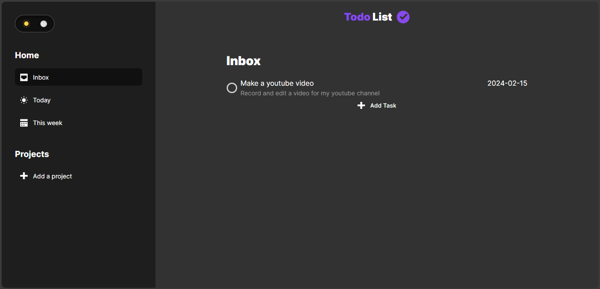

# todo-list

A todo-list project created using JavaScript, HTML, CSS, webpack, and npm, applying the concepts of object-oriented programming. Additionally, I implemented a dark mode

Live site: https://t-dlsantos.github.io/todo-list/

Printout of home page:
